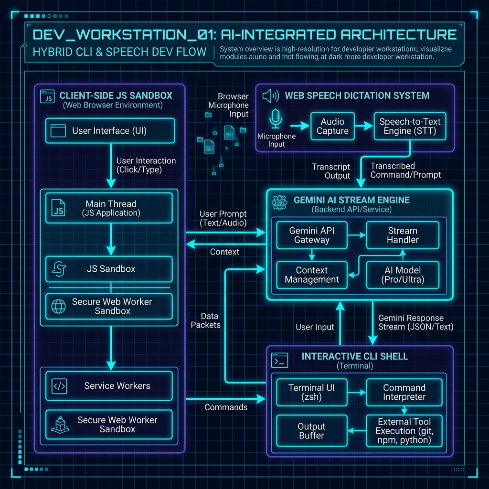

<div align="center">

```
  ___                  _  ____  _          _ _
 / _ \ _ __ ___  _ __ (_)/ ___|| |__   ___| | |
| | | | '_ ` _ \| '_ \| |\___ \| '_ \ / _ \ | |
| |_| | | | | | | | | | | ___) | | | |  __/ | |
 \___/|_| |_| |_|_| |_|_||____/|_| |_|\___|_|_|  STUDIO v2.4
```

# OmniShell Studio

**Browser-Native AI Developer Workstation and Code Sandbox**

A unified, high-performance developer environment that runs entirely in your browser — no installs, no servers, no setup.

[](https://nextjs.org/)
[](https://www.typescriptlang.org/)
[](https://react.dev/)
[](https://tailwindcss.com/)
[](https://www.framer.com/motion/)
[](https://ai.google.dev/)
[](LICENSE)

[**Launch Live Workstation**](https://omnishell-studio.vercel.app) &nbsp;|&nbsp;
[Report Bug](https://github.com/Ebendttl/omnishell-studio/issues) &nbsp;|&nbsp;
[Request Feature](https://github.com/Ebendttl/omnishell-studio/issues)

---



</div>

---

## Table of Contents

- [Overview](#overview)
- [Core Features](#core-features)
  - [Interactive CLI Shell](#1-interactive-cli-shell)
  - [Live JavaScript REPL Sandbox](#2-live-javascript-repl-sandbox)
  - [AI Pair Programmer](#3-ai-pair-programmer-gemini-powered)
  - [Voice Interface](#4-hands-free-voice-interface)
  - [Command Palette](#5-command-palette-cmdk--ctrlk)
- [Tech Stack](#tech-stack)
- [Project Architecture](#project-architecture)
- [Getting Started](#getting-started)
  - [Prerequisites](#prerequisites)
  - [Installation](#installation)
  - [Environment Variables](#environment-variables)
  - [Running Locally](#running-locally)
- [CLI Command Reference](#cli-command-reference)
- [REPL Starter Templates](#repl-starter-templates)
- [Keyboard Shortcuts](#keyboard-shortcuts)
- [Design System](#design-system)
- [API Reference](#api-reference)
- [Configuration](#configuration)
- [Contributing](#contributing)
- [License](#license)

---

## Overview

**OmniShell Studio** is a browser-native AI developer workstation built for public use. It fuses four developer tools that usually exist as separate applications — a CLI shell, a REPL sandbox, an AI pair programmer, and a voice interface — into a single cohesive glassmorphic workstation that lives entirely in your browser tab.

There are no runtimes to install, no Docker containers to spin up, and no backend servers to provision. JavaScript execution runs 100% client-side inside an isolated browser scope. AI responses stream directly from Google Gemini 2.0 Flash. Voice dictation and speech synthesis are powered by the Web Speech API built into your browser.

It was built for developers who want:

- A quick, zero-friction environment to sketch out algorithms and data structures
- Instant access to an AI pair programmer without switching apps
- Hands-free coding via voice dictation when reviewing on a secondary screen
- A shareable, exportable session log of their coding work

---

## Core Features

### 1. Interactive CLI Shell

A fully functional Bash-inspired terminal shell rendered inside the browser with a scrollable output buffer, persistent command history, and a prompt that feels like home.

**Capabilities:**
- Arrow key command history navigation (`Up` / `Down`) with full session buffer recall
- Tab completion hints for all built-in commands
- Syntax-colored output rendering: input prompts in emerald, system messages in cyan, errors in rose, ASCII art in indigo
- `neofetch`-style system info panel with OmniShell ASCII logo
- Piped command chaining via the `eval` and `ai` commands
- Session state persists across panel tab switches within the workstation

**Supported Commands:**

| Command | Description |
|---|---|
| `help` | Print the full interactive CLI command reference manual |
| `neofetch` | Render OmniShell system specs and branded ASCII artwork |
| `ai <prompt>` | Stream a prompt directly to the Gemini AI Pair Programmer panel |
| `eval <code>` | Evaluate inline JavaScript in the isolated REPL sandbox |
| `templates` | List all available starter code template IDs and categories |
| `voice` | Trigger hands-free microphone voice recognition mode |
| `export` | Download the full workspace session log as a `.json` file |
| `clear` | Reset and flush the terminal output buffer |

---

### 2. Live JavaScript REPL Sandbox

A safe, real-time JavaScript execution environment that runs entirely client-side using `new Function()` scope isolation. No code ever leaves your browser for execution — evaluation happens in sub-15ms with zero network latency.

**Capabilities:**
- Live `console.log`, `console.warn`, `console.error` output capture and formatted rendering in the Console Inspector drawer
- Return value inspection with pretty-printed JSON for objects and arrays
- Persistent scope retention across executions — variables declared in one run are available in the next
- Execution time benchmarking displayed as a badge on every run (`Exec: 8ms`)
- One-click code template loading from the built-in library (QuickSort, Async Retry Engine, FSM, Schema Validator)
- "Send to REPL" from AI panel — inject AI-generated code snippets directly into the editor with a single click
- Error catching with `Uncaught Error:` formatted output with the original runtime stack message

**Console Log Types:**

| Log Type | Color | Trigger |
|---|---|---|
| `log` | Slate white | `console.log()` |
| `warn` | Amber | `console.warn()` |
| `error` | Rose red | `console.error()` / runtime error |
| `result` | Emerald + bordered | Return value of expression |
| `system` | Cyan italic | Sandbox init messages |

---

### 3. AI Pair Programmer (Gemini Powered)

A streaming AI chat interface backed by Google Gemini 2.0 Flash, purpose-built for developer workflows. The AI is not a generic chatbot — it is given a specialized system prompt that makes it behave as a senior pair programmer, systems architect, or precision debugger depending on the selected mode.

**Capabilities:**
- Multi-turn conversational context — the AI sees the full message thread, not just the last message
- Streaming response rendering — responses appear token by token as they arrive
- Automatic code block extraction — any code inside a response is detected and presented with a "Send to REPL" action button
- Copy-to-clipboard on any extracted code snippet with a checkmark confirmation animation
- System prompt mode selector:
  - **Senior Pair Programmer** — produces clean, modern, type-safe TypeScript/JavaScript code
  - **System Architect** — critiques for performance bottlenecks, race conditions, and architectural elegance
  - **Precision Debugger** — analyzes stack traces and runtime exceptions to find root causes
- Graceful fallback synthesizer for offline or API-unavailable scenarios

**API Configuration:**

The AI endpoint is at `/api/chat`. It sends `POST` requests to Gemini's `generateContent` endpoint:

```
POST https://generativelanguage.googleapis.com/v1beta/models/gemini-2.0-flash:generateContent?key=<GEMINI_API_KEY>
```

If `GEMINI_API_KEY` is not set, the endpoint returns a smart synthetic fallback code response so the workstation remains usable for REPL demo purposes.

---

### 4. Hands-Free Voice Interface

A Web Speech API integration providing bi-directional voice interaction: microphone dictation of commands and text-to-speech synthesis for AI responses. The interface includes a live HTML5 canvas soundwave frequency visualizer that animates during both input and output phases.

**Capabilities:**
- Continuous microphone speech recognition via `SpeechRecognition` API (Chrome / Edge optimized)
- Final transcript dispatch — dictated text is submitted as an `ai <transcript>` command automatically on phrase completion
- Text-to-speech synthesis via `SpeechSynthesis` with configurable voice and rate
- Live canvas waveform visualizer: three layered sine wave bands (indigo, cyan, emerald) that animate at audio intensity
- Voice active state indicated by a pulsing rose-colored mic badge
- Graceful degradation on browsers without Web Speech API support

**Waveform Visualizer Technical Details:**

The soundwave canvas renders three overlapping sine curves at different phase speeds and amplitudes:

```
Layer 1: rgba(99, 102, 241)   — Indigo   — speed 1.0x, height 14px
Layer 2: rgba(6, 182, 212)    — Cyan     — speed 1.4x, height 10px
Layer 3: rgba(16, 185, 129)   — Emerald  — speed 0.8x, height 8px
```

Intensity scales from `0.05` (idle flat line) to `1.0` (full amplitude during active speech).

---

### 5. Command Palette (Cmd+K / Ctrl+K)

A keyboard-triggered modal command menu with fuzzy search across all quick actions, CLI commands, and code templates. Inspired by Raycast and Linear.

**Capabilities:**
- Global keyboard shortcut: `Cmd+K` (macOS) / `Ctrl+K` (Windows/Linux) — triggers from anywhere on the page
- `Escape` to dismiss
- Fuzzy search filtering across all template names and descriptions in real time
- Quick Action shortcuts:
  - Toggle voice dictation
  - Export workspace session as `.json`
  - Print neofetch system artwork to terminal
- Full code template browser with category badges
- Framer Motion spring animation on open and close

---

## Tech Stack

| Layer | Technology | Version |
|---|---|---|
| Framework | Next.js App Router | 16.3.4 |
| Language | TypeScript | 5.x |
| UI Library | React | 19.2 |
| Styling | Tailwind CSS | 4.x |
| Animations | Framer Motion | 13.x |
| Particle Background | tsParticles | 4.x |
| Icons | Lucide React | 1.44 |
| UI Primitives | Radix UI (Dialog, Tabs) | 1.x |
| AI Provider | Google Gemini 2.0 Flash | REST API |
| Voice | Web Speech API | Browser Native |
| REPL Engine | `new Function()` sandbox | Browser Native |
| Particle Canvas | Custom Canvas API | Browser Native |
| Font | Geist Sans + Geist Mono | Google Fonts |

---

## Project Architecture

```
omnishell-studio/
├── public/
│   └── images/
│       ├── omnishell_architecture_spec.png   # Architecture diagram asset
│       └── omnishell_voice_wave.png          # Voice visualizer preview asset
│
├── src/
│   ├── app/
│   │   ├── globals.css                       # Design tokens, glass utilities, CSS vars
│   │   ├── layout.tsx                        # Root layout with metadata and font config
│   │   ├── page.tsx                          # Main page: 8 sections assembled
│   │   └── api/
│   │       └── chat/
│   │           └── route.ts                  # POST /api/chat — Gemini streaming endpoint
│   │
│   ├── components/
│   │   ├── studio/
│   │   │   ├── WorkstationLayout.tsx         # Resizable dual-pane container + state orchestrator
│   │   │   ├── TerminalPanel.tsx             # CLI shell with history, output buffer, prompt
│   │   │   ├── ReplPanel.tsx                 # JS editor + console inspector + template loader
│   │   │   ├── AiPanel.tsx                   # AI chat stream + code extractor + REPL injection
│   │   │   └── VoiceBar.tsx                  # Soundwave canvas + mic toggle + TTS controls
│   │   │
│   │   ├── layout/
│   │   │   ├── HeaderNav.tsx                 # Sticky nav with brand, status badges, Cmd+K
│   │   │   └── CommandPalette.tsx            # Framer Motion modal with fuzzy search
│   │   │
│   │   └── ui/
│   │       ├── ThemeToggle.tsx               # Animated Sun/Moon theme switcher
│   │       ├── GlowCard.tsx                  # Glassmorphic card with hover glow variants
│   │       ├── ParticleBackground.tsx        # Constellation particle canvas backdrop
│   │       └── ToastMonitor.tsx              # Spring-animated status toast system
│   │
│   └── lib/
│       ├── repl-engine.ts                    # Client-side JS eval engine with console capture
│       ├── speech-engine.ts                  # Web Speech API wrappers (SpeechRecognition + TTS)
│       └── templates.ts                      # CODE_TEMPLATES + SYSTEM_PROMPTS data
│
├── PROJECT_BLUEPRINT.md                      # Master architecture spec and pattern reusability guide
├── IMPLEMENTATION_PLAN.md                    # Step-by-step implementation strategy
├── TASTESKILL_PROMPT.md                      # Design taste rules and anti-slop aesthetic dials
└── README.md
```

### Data Flow

```
User Input
    │
    ├─── CLI Terminal ──► WorkstationLayout.handleExecuteCli()
    │                         │
    │                         ├── "ai <prompt>"    ──► POST /api/chat ──► Gemini API ──► AiPanel stream
    │                         ├── "eval <code>"    ──► repl-engine.ts ──► browser scope
    │                         ├── "export"         ──► JSON blob download
    │                         └── "neofetch/help"  ──► ASCII output render
    │
    ├─── REPL Editor ───► executeJsRepl() ──► new Function() sandbox
    │                         │
    │                         └── console capture ──► ConsoleInspector drawer
    │
    ├─── AI Panel ──────► POST /api/chat ──► Gemini 2.0 Flash
    │                         │
    │                         └── code blocks extracted ──► "Send to REPL" action
    │
    └─── Voice Bar ─────► SpeechRecognition ──► onDictatedText ──► "ai <transcript>"
                              │
                              └── SpeechSynthesis ──► canvas waveform animation
```

---

## Getting Started

### Prerequisites

Before you begin, ensure you have the following installed:

- **Node.js** >= 18.17.0
- **npm** >= 9.x
- A Google Gemini API key (optional — the workstation works without one using a smart fallback synthesizer)

### Installation

1. **Clone the repository:**

```bash
git clone https://github.com/Ebendttl/omnishell-studio.git
cd omnishell-studio
```

2. **Install dependencies:**

```bash
npm install
```

### Environment Variables

Create a `.env.local` file in the project root:

```bash
cp .env.example .env.local
```

Then populate the values:

```env
# Required for AI Pair Programmer live mode
# Get your key at: https://aistudio.google.com/app/apikey
GEMINI_API_KEY=your_gemini_api_key_here
```

> **Note:** If `GEMINI_API_KEY` is not provided, the `/api/chat` endpoint returns a smart synthetic fallback response that includes a runnable JavaScript code snippet. All other workstation features (CLI, REPL sandbox, Voice, Command Palette) work fully without an API key.

### Running Locally

**Development server (with Turbopack hot reload):**

```bash
npm run dev
```

The workstation will be available at [http://localhost:3000](http://localhost:3000).

**Production build verification:**

```bash
npm run build
npm start
```

**TypeScript type check (zero errors target):**

```bash
npx tsc --noEmit
```

---

## CLI Command Reference

Once inside the Live Workstation, click on the **CLI Terminal** tab and type any of the following commands at the `dev@omnishell:~$` prompt:

### `help`
Prints the full interactive command reference.

```
dev@omnishell:~$ help
```

```
OmniShell Interactive CLI Reference:
  help              - Display this command manual
  neofetch          - Render OmniShell system specs & ASCII logo
  ai <prompt>       - Stream prompt directly to AI Pair Programmer
  eval <code>       - Evaluate JavaScript directly in isolated REPL sandbox
  templates         - List available code starter templates
  voice             - Trigger hands-free voice recognition mode
  export            - Download workspace session logs as .json
  clear             - Reset terminal buffer output
```

---

### `neofetch`
Renders the OmniShell system info panel.

```
dev@omnishell:~$ neofetch
```

```
  OS: OmniShell Studio Web Sandbox v2.4
  Host: Browser Client (V8 JS Engine)
  Kernel: Next.js App Router 15.x
  Uptime: Active Session
  Shell: omni-bash 5.2.15
  CPU: Gemini AI Stream Engine
  Memory: Browser Scope Persistence Active
```

---

### `ai <prompt>`
Dispatches a prompt to the AI Pair Programmer. The AI panel activates and streams the response in real time.

```
dev@omnishell:~$ ai Write a debounce function in TypeScript
```

---

### `eval <code>`
Executes inline JavaScript directly in the REPL sandbox and prints the result.

```
dev@omnishell:~$ eval const sum = [1,2,3,4,5].reduce((a,b) => a+b, 0); return sum
[Eval (3ms)]: 15
```

---

### `templates`
Lists all pre-loaded starter template IDs.

```
dev@omnishell:~$ templates
```

```
Starter Templates:
• algo-quick-sort: QuickSort Visualization (Algorithms)
• async-fetcher: Async API Retry Engine (Async API)
• state-machine: Finite State Machine (State Machines)
• schema-validator: Data Schema Validator (Data Specs)
Use 'eval' or Command Palette (Cmd+K) to load.
```

---

### `export`
Downloads the current workspace session (terminal history + AI chat history) as a timestamped `.json` file.

```
dev@omnishell:~$ export
```

Produces: `omnishell-session-1725967200000.json`

---

### `clear`
Flushes all output from the terminal buffer.

```
dev@omnishell:~$ clear
```

---

## REPL Starter Templates

Four production-quality code snippets are pre-loaded and accessible from the REPL template selector dropdown or the Command Palette (`Cmd+K`).

### QuickSort Visualization (`Algorithms`)
In-place array partitioning with step-by-step console execution logs and final sorted array output with min/max stats.

### Async API Retry Engine (`Async API`)
Resilient exponential backoff fetch simulation engine. Demonstrates retry loops, delay calculations, and async/await error propagation chains.

### Finite State Machine (`State Machines`)
A `DeploymentFSM` class implementing a state transition machine for a CI/CD pipeline: `IDLE → BUILDING → TESTING → DEPLOYED`. Includes invalid transition warnings and full history tracing.

### Data Schema Validator (`Data Specs`)
A runtime payload validator that checks object key presence and type correctness against a schema definition. Produces a detailed validation error report.

---

## Keyboard Shortcuts

| Shortcut | Action |
|---|---|
| `Cmd+K` / `Ctrl+K` | Open the global Command Palette |
| `Escape` | Close the Command Palette |
| `↑` Arrow | Recall previous command from terminal history buffer |
| `↓` Arrow | Navigate forward through terminal history buffer |
| `Tab` | Auto-completion hint for CLI commands |
| `Enter` | Submit terminal command or AI chat message |
| `Alt+R` | Run the current REPL sandbox code |

---

## Design System

OmniShell Studio uses a custom dark-tech glassmorphic design token system defined in `src/app/globals.css`.

### Color Tokens

| Token | HSL Value | Usage |
|---|---|---|
| `--bg-main` | `220 25% 6%` | Page background |
| `--bg-card` | `220 20% 9%` | Panel card backgrounds |
| `--border-glass` | `220 15% 18%` | Subtle glass borders |
| `--border-accent` | `217 91% 60%` | Active/hover accent borders |
| `--fg-primary` | `210 40% 98%` | Primary text |
| `--fg-secondary` | `215 20% 65%` | Secondary/muted labels |
| `--cyan-glow` | `186 100% 50%` | Cyan accent glow |
| `--emerald-glow` | `155 100% 50%` | Emerald accent glow |
| `--indigo-glow` | `239 84% 67%` | Indigo accent glow (primary) |
| `--amber-glow` | `38 92% 50%` | Amber accent glow |

### Utility Classes

| Class | Effect |
|---|---|
| `.glass-panel` | Dark glass background with `backdrop-filter: blur(16px)` and subtle border |
| `.glass-panel-interactive` | Glass panel with hover lift (`translateY(-2px)`) and indigo border glow |
| `.glow-indigo` | `box-shadow: 0 0 25px -5px rgba(99, 102, 241, 0.35)` |
| `.glow-cyan` | `box-shadow: 0 0 25px -5px rgba(6, 182, 212, 0.35)` |
| `.glow-emerald` | `box-shadow: 0 0 25px -5px rgba(16, 185, 129, 0.35)` |
| `.text-gradient` | White to indigo to cyan diagonal gradient text fill |
| `.text-gradient-emerald` | White to emerald gradient text fill |
| `.bg-scanline` | 32px grid scanline pattern overlay |

### GlowCard Variants

`GlowCard` accepts a `glowColor` prop with four variants: `indigo`, `cyan`, `emerald`, `amber`. Each applies the matching glow on hover.

---

## API Reference

### `POST /api/chat`

Streams an AI code generation response from Google Gemini 2.0 Flash.

**Request body:**

```json
{
  "messages": [
    { "role": "user", "content": "Write a merge sort function" }
  ],
  "systemPromptId": "pair-programmer"
}
```

**System Prompt IDs:**

| ID | Role Description |
|---|---|
| `pair-programmer` | Senior Pair Programmer — clean, type-safe TypeScript solutions |
| `architecture-coach` | System Architect — performance critique and design patterns |
| `code-debugger` | Precision Debugger — root cause analysis and fix diffs |

**Success response:**

```json
{
  "reply": "Here is a merge sort implementation:\n\n```typescript\nfunction mergeSort(arr: number[]): number[] {\n  ...\n}\n```"
}
```

**Error response:**

```json
{
  "error": "Internal Server Error"
}
```

---

### `executeJsRepl(code, clearScope?)` — `src/lib/repl-engine.ts`

Client-side safe JavaScript execution engine.

```typescript
import { executeJsRepl } from '@/lib/repl-engine';

const result = executeJsRepl(`
  const nums = [1, 2, 3];
  console.log(nums);
  return nums.length;
`);

// result.success         => true
// result.returnValue     => 3
// result.logs            => [{ type: 'log', content: '[ 1, 2, 3 ]', ... }]
// result.executionTimeMs => 2
```

| Parameter | Type | Description |
|---|---|---|
| `code` | `string` | JavaScript code string to evaluate |
| `clearScope` | `boolean?` | If `true`, clears persistent scope context before execution |

---

### `speechEngine` — `src/lib/speech-engine.ts`

Singleton Web Speech API manager.

```typescript
import { speechEngine } from '@/lib/speech-engine';

// Start listening for microphone input
speechEngine.startListening(
  (transcript, isFinal) => { if (isFinal) console.log(transcript); },
  (error) => console.error(error),
  () => console.log('Listening ended')
);

// Stop microphone input
speechEngine.stopListening();

// Speak text aloud
speechEngine.speak('Hello, developer!', () => console.log('Done'));

// Cancel ongoing speech
speechEngine.cancelSpeech();

// Set audio intensity callback (0.0 to 1.0) for visualizer
speechEngine.setIntensityCallback((intensity) => setWaveIntensity(intensity));
```

---

## Configuration

### `next.config.ts`

```typescript
const nextConfig = {
  // Configure additional image domains if needed
};
```

### `tsconfig.json`

Path alias `@/*` maps to `src/*` for clean imports:

```json
{
  "compilerOptions": {
    "paths": {
      "@/*": ["./src/*"]
    }
  }
}
```

---

## Contributing

Contributions are welcome. To contribute:

1. **Fork** this repository
2. **Create a feature branch:**
   ```bash
   git checkout -b feature/your-feature-name
   ```
3. **Make your changes** — follow the existing TypeScript strict conventions
4. **Run type checks** before committing:
   ```bash
   npx tsc --noEmit
   ```
5. **Check for em/en dashes** — the project has a zero em-dash policy:
   ```bash
   grep -r $'\u2014\|\u2013' src/ --include="*.tsx" --include="*.ts"
   ```
6. **Commit** with a clear conventional commit message:
   ```bash
   git commit -m "feat: add <feature-name>"
   ```
7. **Push** and open a pull request

### Code Conventions

- All components use `"use client"` only when browser APIs are required
- No inline styles — all styling via Tailwind utility classes or `globals.css` tokens
- No `any` types — use proper TypeScript interfaces and generics
- Component props are typed with explicit interfaces, not `React.FC`
- Console logs are removed before committing (except inside `repl-engine.ts` intentionally)

---

## License

MIT License — see [LICENSE](LICENSE) for details.

---

<div align="center">

Built by [Ebendttl](https://github.com/Ebendttl) &nbsp;|&nbsp;
Powered by [Google Gemini](https://ai.google.dev/) &nbsp;|&nbsp;
[Star this repo](https://github.com/Ebendttl/omnishell-studio)

</div>
